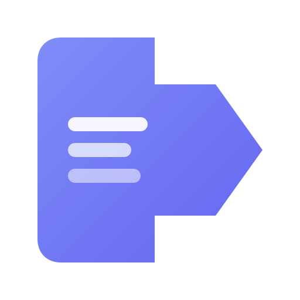
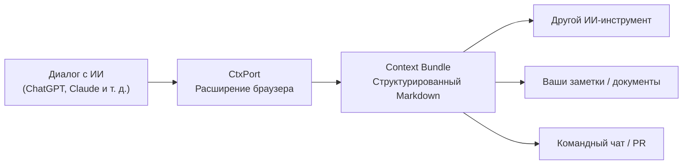

<div align="center">



# CtxPort

### **Один клик. Структурированный Markdown. Любой диалог с ИИ.**

Ваши диалоги с ИИ достойны буфера обмена получше.

[](https://github.com/nicepkg/ctxport)
[](LICENSE)
[](https://github.com/nicepkg/ctxport/pulls)
[](https://developer.chrome.com/docs/extensions/mv3/)

[简体中文](./README_cn.md) | [English](./README.md) | Русский

**Поддерживаемые платформы**

[](https://chatgpt.com)
[](https://claude.ai)
[](https://gemini.google.com)
[](https://chat.deepseek.com)
[](https://grok.com)
[](https://www.doubao.com)
[](https://github.com)

<br />

[Быстрый старт](#быстрый-старт) · [Возможности](#возможности) · [Документация](https://ctxport.xiaominglab.com)

</div>

---

## Проблема

Вы только что потратили 45 минут на глубокий разговор с ChatGPT. Вы нашли идеальную архитектуру для своего проекта. Теперь её нужно передать Claude, чтобы перейти к реализации.

Что делать?

**Ctrl+A, Ctrl+C?** Получится каша из HTML-артефактов, сломанного форматирования и потерянных блоков кода.

**Копировать каждое сообщение вручную?** Жизнь слишком коротка.

**Сделать скриншот?** Текст на картинках — верный способ похоронить знания.

Диалоги с ИИ — новая единица интеллектуальной работы. Но переносить их между инструментами — всё равно что отправлять PDF по факсу в 2026 году.

**CtxPort решает эту проблему.** Один клик — и весь диалог превращается в чистый структурированный Markdown-документ, Context Bundle («пакет контекста»), готовый к вставке в любой ИИ-инструмент, редактор или базу знаний.

### В чём разница

|                                 | Без CtxPort                                                           | С CtxPort                                 |
| :------------------------------ | :-------------------------------------------------------------------- | :---------------------------------------- |
| **Скопировать диалог**          | Выделить всё, скопировать, вставить и 10 минут править форматирование | Один клик — готово                        |
| **Перенести контекст между ИИ** | Заново вводить всю историю диалога                                    | Вставить Context Bundle и продолжить      |
| **Сохранить диалог**            | Добавить в закладки и надеяться, что ссылка не пропадёт               | Структурированный Markdown навсегда у вас |
| **Поделиться с командой**       | «Сейчас сделаю скриншот…»                                             | Отправить аккуратный файл `.md`           |
| **Извлечь только код**          | Пролистать 50 сообщений в поисках фрагментов                          | Режим Code Only, один клик                |

### Главные преимущества

```
  Аккаунт не нужен        Работает офлайн
  Данные не выгружаются   Обработка 100% локальная
  Минимум разрешений      Открытый код (MIT)
```

---

## Как это работает



1. **Откройте** любую поддерживаемую платформу
2. **Нажмите** кнопку копирования CtxPort (или сочетание клавиш `Alt+Shift+C`)
3. **Вставьте** структурированный Context Bundle куда угодно

Вот и всё. Никаких настроек. Никакой регистрации. Никакого облака.

---

## Возможности

### Копирование откуда угодно

| Возможность                                | Описание                                                                            |
| :----------------------------------------- | :---------------------------------------------------------------------------------- |
| **Кнопка копирования в чате**              | Кнопка появляется прямо в диалоге — нажмите её, чтобы скопировать всю переписку     |
| **Копирование из списка в боковой панели** | Наведите курсор на любой диалог в боковой панели и скопируйте его, даже не открывая |
| **Сочетание клавиш**                       | `Alt+Shift+C` мгновенно копирует текущий диалог                                     |
| **Несколько форматов**                     | Full, User Only, Code Only, Compact — выберите нужный                               |

### Копирование из списка в боковой панели — функция, которой больше ни у кого нет

Большинство инструментов для копирования заставляют сначала открыть диалог. В CtxPort достаточно навести курсор на диалог в боковой панели и скопировать его напрямую. Нужно собрать пять диалогов для брифа проекта? Навели, нажали, навели, нажали. Без загрузки страниц и ожидания.

### Формат Context Bundle

При каждом копировании создаётся структурированный Markdown-документ с метаданными в блоке front matter:

```markdown
---
ctxport: v2
source: chatgpt
url: https://chatgpt.com/c/abc123
title: "Обсуждение аутентификации REST API"
date: 2026-02-07T14:30:00Z
nodes: 24
format: full
---

## User

Я разрабатываю SaaS-продукт и выбираю между аутентификацией
по API-ключу и OAuth2. Что вы посоветуете?

## Assistant

В вашем случае я бы рекомендовал многоуровневый подход...
```

По метаданным из блока front matter принимающий инструмент точно понимает, откуда взялся диалог, когда он состоялся и сколько в нём сообщений. Это структурированный контекст, а не просто сырой текст.

### Форматы копирования

| Формат        | Что вы получите                          | Для чего подходит                                |
| :------------ | :--------------------------------------- | :----------------------------------------------- |
| **Full**      | Полный диалог со всеми сообщениями       | Перенос контекста между ИИ-инструментами         |
| **User Only** | Только ваши сообщения (промпты)          | Повторное использование промптов в другом ИИ     |
| **Code Only** | Извлечённые блоки кода с указанием языка | Копирование фрагментов реализации                |
| **Compact**   | Сжатые сообщения, каждое — одним абзацем | Быстрая отправка в чате или по электронной почте |

---

## Быстрый старт

### Установка из Chrome Web Store

> Скоро — расширение пока в разработке. Поставьте репозиторию звезду, чтобы не пропустить релиз!

### Сборка из исходного кода

```bash
# Клонируйте репозиторий
git clone https://github.com/nicepkg/ctxport.git
cd ctxport

# Установите зависимости
pnpm install

# Соберите все пакеты
pnpm build

# Запустите расширение в режиме разработки
pnpm dev:ext
```

Затем на странице `chrome://extensions` загрузите распакованное расширение из каталога `apps/browser-extension/dist/chrome-mv3-dev`.

### Использование

1. Откройте любую поддерживаемую платформу (ChatGPT, Claude, Gemini, DeepSeek, Grok, Doubao или GitHub)
2. Начните новый диалог или откройте существующий
3. Нажмите появившуюся в чате **кнопку копирования CtxPort** или сочетание клавиш `Alt+Shift+C`
4. Вставьте Context Bundle туда, где он нужен

Чтобы скопировать диалог из списка, наведите на него курсор в левой боковой панели — появится значок копирования.

---

## Планы развития

- [x] Поддержка ChatGPT
- [x] Поддержка Claude
- [x] Поддержка Gemini
- [x] Поддержка DeepSeek
- [x] Поддержка Grok
- [x] Поддержка Doubao (豆包)
- [x] Поддержка GitHub Issues и Pull Requests
- [x] Копирование из списка в боковой панели
- [x] Несколько форматов копирования
- [x] Сочетания клавиш
- [ ] Публикация в Chrome Web Store
- [ ] Поддержка Firefox
- [ ] Импорт Context Bundle (вставка пакета для восстановления контекста диалога)
- [ ] Пакетный экспорт (выбор нескольких диалогов и экспорт одним пакетом)
- [ ] Пользовательские шаблоны формата

---

## Архитектура

```
ctxport/
  packages/
    core-schema/       # Схемы Zod для формата Context Bundle
    core-plugins/      # Адаптеры платформ (ChatGPT, Claude и т. д.)
    core-markdown/     # Движок сериализации в Markdown
    shared-ui/         # Общие компоненты React
  apps/
    browser-extension/ # WXT + React 19 + Tailwind CSS 4
```

Проект устроен как монорепозиторий на pnpm workspaces и Turborepo. Адаптер каждой платформы — самостоятельный плагин, поэтому поддержку новых платформ легко добавлять.

---

## Участие в разработке

Любой вклад приветствуется: сообщение об ошибке, предложение новой функции, Pull Request — помогает всё.

```bash
# Создайте форк и клонируйте репозиторий
git clone https://github.com/YOUR_USERNAME/ctxport.git

# Установите зависимости
pnpm install

# Запустите режим разработки
pnpm dev:ext
```

Подробные инструкции — в файле [CONTRIBUTING.md](CONTRIBUTING.md).

### Участники

<a href="https://github.com/nicepkg/ctxport/graphs/contributors">
  
</a>

---

## Лицензия

[MIT](LICENSE) — используйте как угодно.

---

<div align="center">

**Если CtxPort экономит вам время, звезда проекту не помешает.**

Так больше людей узнает о проекте, а его разработка продолжится.

[](https://github.com/nicepkg/ctxport)

</div>
